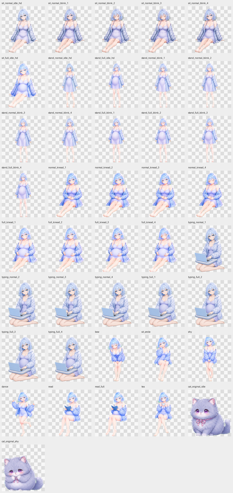

# 闪光少女桌宠

一个已经完成的 Windows 2D 本地桌宠。项目使用 Python、PySide6 和 Pillow 实现透明置顶窗口，角色素材与程序源码一同提供。



## 已实现的功能

- 鼠标拖动、点击头部眨眼、点击身体鞠躬、点击脚部跳跃。
- 右键菜单触发招手、跳跃、揉肚子、鞠躬、害羞、跳舞、喝茶等动作。
- 坐下、站立、看书、敲键盘等持续状态，以及可保存的“吃饱饭”外观状态。
- 可调整显示大小，显示可选的 CPU、内存、磁盘与网络状态面板。
- 启动和退出动画；设置保存在当前用户的应用数据目录。

本版本是本地桌面互动程序，没有接入大语言模型或联网聊天功能。它也不包含自动散步功能。

## 运行

在 Windows 上安装 Python 3.11 或更新版本，然后在项目目录执行：

```powershell
python -m pip install -r requirements.txt
python yuli_deluxe_qt.pyw
```

可先检查素材是否齐全：

```powershell
python yuli_deluxe_qt.pyw --smoke-test
```

用 PyInstaller 生成单文件程序：

```powershell
python -m pip install pyinstaller
python -m PyInstaller "桌宠.spec"
```

## 项目结构

- `yuli_deluxe_qt.pyw`：桌宠程序。
- `assets/`：运行所需的最终角色素材。
- `generated/`：用于制作最终动作素材的原始绘制图。
- `prepare_flash_assets.py`：从绘制图生成 `assets/` 的工具。
- `make_qa_sheet.py`、`qa-supplemental.png`：动作检查图的生成脚本与预览。
- `桌宠.spec`：PyInstaller 打包配置。

这是个人作品的源码展示。暂未添加开源许可证；转载、改编或商用请先征得作者同意。
